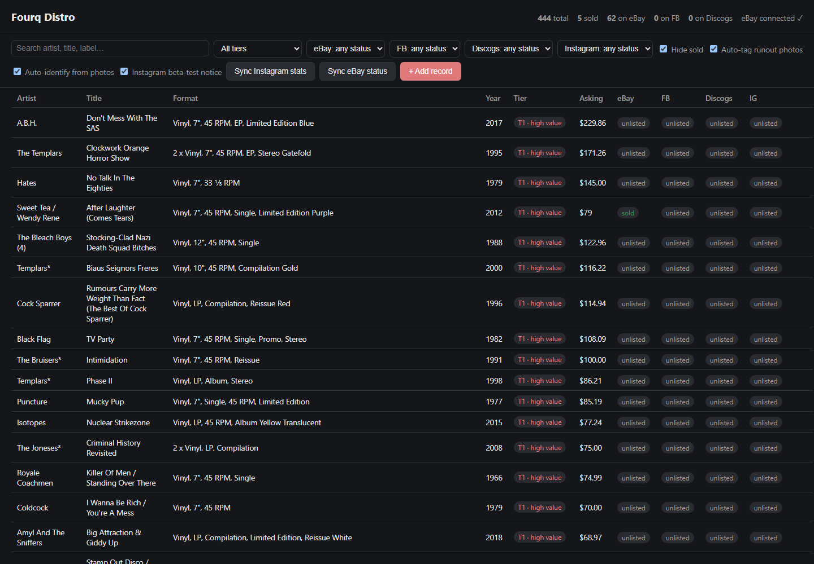
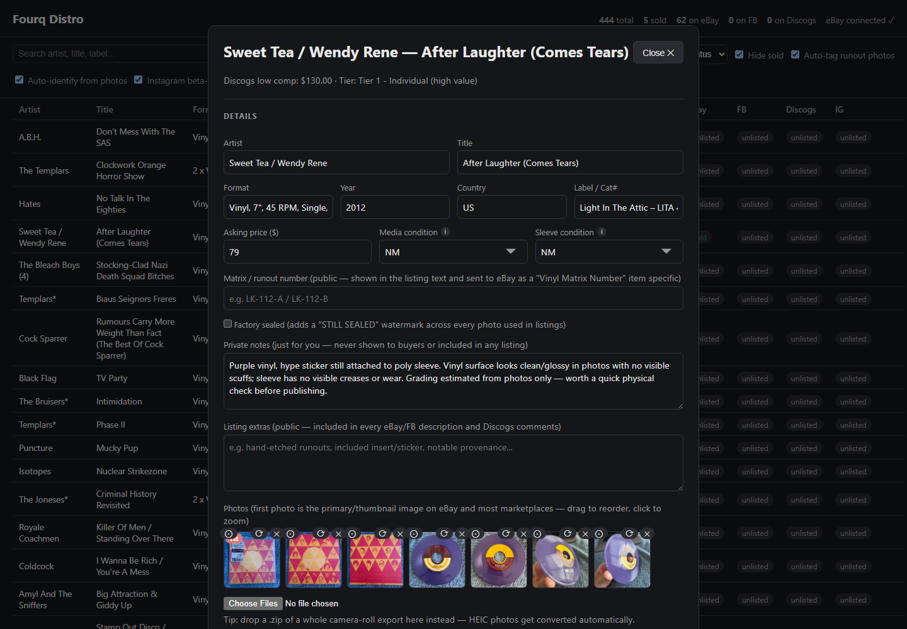
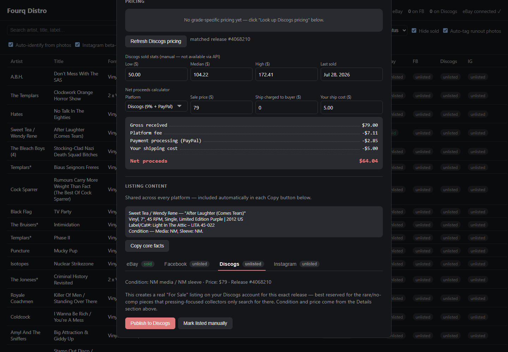

# Fourq Distro — Record Inventory & Listing Manager

A local Node/Express app for cataloging a vinyl record collection and
publishing listings to eBay, Discogs, and Instagram from one place. No build
step, no database — inventory is a JSON file on disk. Built for a single
user running it on their own machine.

## What it does

- **Catalog records** — artist/title/label/format/year/country, condition,
  pricing, and notes, one panel per record.
- **Photos** — drop a `.zip` export from your phone's camera roll; HEIC
  conversion, orientation fixes, and branding (a border + "still sealed"
  ribbon) all happen automatically.
- **Pricing help** — pulls Discogs price suggestions for a record's specific
  release and condition grade.
- **Auto-identify** *(optional, needs a local Ollama vision model)* — reads
  a new arrival's cover/label photos to pre-fill artist/title/label/etc.
- **Publish** — push a listing straight to eBay, Discogs, or Instagram (as a
  single image or photo carousel) with one click, and track its status.
- **Interactive API docs** at `/docs` once the server is running.

## Screenshots

| Inventory table | Record panel | Per-platform publish options |
| --- | --- | --- |
|  |  |  |

## Setup

```bash
npm install
cp .env.example .env    # fill in whichever integrations you want to use
npm start                # http://localhost:3000
```

The app runs fine with `.env` empty — every integration is optional and is
simply unavailable (or silently skipped) until configured. For account
setup and API keys, see:

- [`EBAY_SETUP.md`](EBAY_SETUP.md)
- [`DISCOGS_SETUP.md`](DISCOGS_SETUP.md)
- [`INSTAGRAM_SETUP.md`](INSTAGRAM_SETUP.md)
- [`CLOUDINARY_SETUP.md`](CLOUDINARY_SETUP.md) — required for eBay/Instagram
  photo hosting
- [`OLLAMA_SETUP.md`](OLLAMA_SETUP.md) — optional, for auto-identify

## Day-to-day use

Everything — grading, pricing, photo upload, and publishing — happens
through the web UI at `http://localhost:3000`. No AI involvement needed for
routine cataloging.

## Working with Claude on this project

Claude is only brought in for judgment calls — code changes, bug fixes,
identifying an obscure record, or pricing research the app can't automate —
not for routine cataloging. Full conventions, architecture notes, and the
Claude session workflow live in [`CLAUDE.md`](CLAUDE.md).
